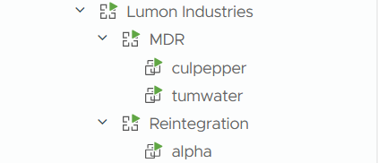

## Terraform Managed vCenter vApps and Virtual Machines

### Motivation

Currently, to build our virtual machines within a given vSphere instance (_we've many_), we're using Ansible's `community.vmware.vmware_guest` module which works fine but has limitations.  When a machine is built, it's placed within the datacenter root: -

```bash
├── vCenter
│   └── Datacenter
│       └── Cluster
│          └── NEW VM  <<<
```

If the virtual machine is left there, you can run the playbook again, Ansible will see that the virtual machine exists, report OK and end.  However, if you move the virtual machine to a vApp, which we typically do for each customer, ansible fails with: -

```python
An exception occurred during task execution. To see the full traceback, use -vvv. The error was: TypeError: argument of type 'NoneType' is not iterable
fatal: [vmmar5be01.foo.bar.com -> localhost]: FAILED! => changed=false
  module_stderr: |-
    Traceback (most recent call last):
      File "/home/liam/.ansible/tmp/ansible-tmp-1743542487.7318742-126898-155884768968531/AnsiballZ_vmware_guest.py", line 107, in <module>
        _ansiballz_main()
      File "/home/liam/.ansible/tmp/ansible-tmp-1743542487.7318742-126898-155884768968531/AnsiballZ_vmware_guest.py", line 99, in _ansiballz_main
        invoke_module(zipped_mod, temp_path, ANSIBALLZ_PARAMS)
      File "/home/liam/.ansible/tmp/ansible-tmp-1743542487.7318742-126898-155884768968531/AnsiballZ_vmware_guest.py", line 47, in invoke_module
        runpy.run_module(mod_name='ansible_collections.community.vmware.plugins.modules.vmware_guest', init_globals=dict(_module_fqn='ansible_collections.community.vmware.plugins.modules.vmware_guest', _modlib_path=modlib_path),
      File "/usr/lib/python3.10/runpy.py", line 224, in run_module
        return _run_module_code(code, init_globals, run_name, mod_spec)
      File "/usr/lib/python3.10/runpy.py", line 96, in _run_module_code
        _run_code(code, mod_globals, init_globals,
      File "/usr/lib/python3.10/runpy.py", line 86, in _run_code
        exec(code, run_globals)
      File "/tmp/ansible_community.vmware.vmware_guest_payload_pf75ix3a/ansible_community.vmware.vmware_guest_payload.zip/ansible_collections/community/vmware/plugins/modules/vmware_guest.py", line 3682, in <module>
      File "/tmp/ansible_community.vmware.vmware_guest_payload_pf75ix3a/ansible_community.vmware.vmware_guest_payload.zip/ansible_collections/community/vmware/plugins/modules/vmware_guest.py", line 3601, in main
      File "/tmp/ansible_community.vmware.vmware_guest_payload_pf75ix3a/ansible_community.vmware.vmware_guest_payload.zip/ansible_collections/community/vmware/plugins/module_utils/vmware.py", line 1282, in get_vm
    TypeError: argument of type 'NoneType' is not iterable
  module_stdout: ''
  msg: |-
    MODULE FAILURE
    See stdout/stderr for the exact error
  rc: 1
```

Now, if we look at `/ansible_collections/community/vmware/plugins/module_utils/vmware.py`, the error is generated from Ansible looking at the `vm_folder`: -

```bash
...
elif vms:
    # Unique virtual machine found.
    actual_vm_folder_path = self.get_vm_path(content=self.content, vm_name=vms[0])
    if self.params.get('folder') is None:
        vm_obj = vms[0]
    elif self.params['folder'] in actual_vm_folder_path:
        vm_obj = vms[0]
...
```

Which makes sense, you create a virtual machine in one place and you move it, the folder changes.  *WRONG*.  I looked at the folder for the virtual machine I created and then moved using: -

```yaml
- name: Get VM Info
  community.vmware.vmware_vm_info:
    hostname: "{{ vcenter_hostname }}"
    username: "{{ vcenter_username }}"
    password: "{{ vcenter_password }}"
    validate_certs: no
  register: vm_info
  delegate_to: localhost

- name: Extract Folder Path
  set_fact:
    actual_vm_folder: "{{ vm_info.virtual_machines[0].folder }}"

- name: Debug Folder Path
  debug:
    msg: "VM {{ inventory_hostname }} is in folder {{ actual_vm_folder }}"
```

And calling the playbook with: -

```bash
ap -i hosts/hosts-foo.yml create-vms.yml -J --limit vmmar5be01.foo.bar.com
```

We can see from the output that the path pre and post vApp move *ARE THE SAME!*

Default root path: -

```bash
TASK [create-machines : Debug Folder Path] ***************************************************************************************************************************************
Monday 31 March 2025  18:34:10 +0100 (0:00:00.107)       0:01:41.161 **********
ok: [vmmar5be01.foo.bar.com] =>
  msg: VM vmmar5be01.foo.bar.com is in folder /100357654-LUMON-DK/vm
```

```bash
vApp path
TASK [create-machines : Debug Folder Path] ***************************************************************************************************************************************
Monday 31 March 2025  18:38:09 +0100 (0:00:00.129)       0:01:39.368 **********
ok: [vmmar5be01.foo.bar.com] =>
  msg: VM vmmar5be01.foo.bar.com is in folder /100357654-LUMON-DK/vm
```
### Project Setup

To setup a new project, you'll need to add your vSphere credentials in `providers.tf`: -
```hcl
provider "vsphere" {
  user           = "USERNAME"
  password       = "PASSWORD"
  vsphere_server = "SERVER_URL"
  allow_unverified_ssl = true 
}
```
I need to add a method of allowing the user to have multiple vSphere clients, but this is just an PoC example.

Next, you need to create a directory within `./environments` for the DC along with a `*.tfvars` file within said directory.  This could be for `dev`, `staging` or `production`, entirely your choosing.  Inside the `*.tfvars` file is where we hold the setup for the project, this include the DC details, vApp config and VM config.  Example project setup which creates a parent vApp called `Lumon`, a child vApp called `MDR` and then two VMs within the `MDR` vApp: -

```hcl
############################
# Datacenter Configuration #
############################
datacenter = "MDR-DC"
cluster    = "MDR-CLUSTER"
datastore  = "MDR-DS"
template   = "mdr_d11"

#################################
#### vApp + VM Configuration ####
#################################
region_vapp = "Lumon Industries" # Top level vApp

projects = { # All projects and related VMs
  proj_mdr = {
    name = "MDR" # Project specific vApp
    vms = {      # VMs for said vApp
      mdr_tumwater = {
        name     = "tumwater"
        num_cpus = 4
        memory   = 2048
        networks = [ # List of NICs with their respective IP configurations
          {
            name       = "mdr-internal"
            ip_address = "172.16.46.30"
            netmask    = 27
          },
          {
            name       = "lumon-pub"
            ip_address = "10.11.12.13"
            netmask    = 24
          },
          {
            name       = "lumon-pub"
            ip_address = "10.11.12.14"
            netmask    = 24
          }
        ]
        gateway         = "172.16.46.1"
        dns_servers     = ["172.16.46.1", "192.168.50.11", "1.1.1.1"] # /etc/resolv.conf nameservers
        dns_suffix      = ["mdr.lumon.com"] # /etc/resolv.conf search domain
        domain          = "mdr.lumon.com"
        disks = [
          {
            size             = 50 # Root disk
            thin_provisioned = false
          },
          {
            size = 50  # Data disk
            thin_provisioned = false
          }
        ]
      },
      mdr_culpepper = {
        name     = "culpepper"
        num_cpus = 2
        memory   = 4096
        networks = [
          {
            name       = "mdr-internal"
            ip_address = "172.16.46.29"
            netmask    = 27
          }
        ]
        gateway     = "172.16.46.1"
        dns_servers = ["172.16.46.1", "192.168.50.11"]
        dns_suffix  = ["mdr.lumon.com"] 
        domain      = "mdr.lumon.com"
        disks = [
          {
            size             = 50 # Root disk
            thin_provisioned = false
          }
        ]
      }
    }
  }
}
```

### Quirks

Before we get started, there are a few things to note.  Let's say you've built your machine and then find out you need to add a nameserver to the `dns_servers` list.  You then run a plan and see: -

```bash
Terraform will perform the following actions:

  # module.vms["proj_reintegration.reintegration_alpha"].vsphere_virtual_machine.vm must be replaced
...
          ~ customize {
              ~ dns_server_list      = [ # forces replacement
                    # (1 unchanged element hidden)
                    "8.8.4.4",
                  + "1.1.1.1",
                ]
...
Plan: 1 to add, 0 to change, 1 to destroy.
```

This happens because in the vsphere provider, network configuration parameters (_including DNS servers_) are treated as immutable properties of the virtual machine resource.  The provider doesn't implement the capability to modify these network settings in-place on an existing VM.
 The underlying reason is that the Terraform vsphere provider was designed with an "immutable infrastructure" philosophy for many core VM attributes.  Instead of attempting to make surgical changes to running VMs, it prefers to rebuild them entirely to match the desired state.

If you've a machine, like a database, I'd tread very carefully updating config post deployment.  If want to make the resource without destorying the machine, you could consider using the `terraform import` workflow to bring the modified VM back under management after making changes outside of Terraform.

### Creating the Infrastructure

As with any new Terraform project, run `terraform init` to being in the provider and initialize any modules.  Next, we want to target out project tfvars file, we can do that with: -

```bash
terrafrom plan -var-file=environments/copenhagen/lumon.tfvars
```

Once the plan has completed, we should see the additions, changes and destruction based of the current tfstate file.  This is example is a fresh project so only addtions will show: -

```bash
...
Plan: 6 to add, 0 to change, 0 to destroy.
```

Now, we can apply our config.  It's safer to use apply with `-auto-approve` and confirm on the CLI but this is a PoC and I consider it 'safe': -

```bash
terrafrom apply -auto-approve -var-file=environments/copenhagen/lumon.tfvars
```

Check the output, make sure nothing has failed: -

```bash
...
module.vms["proj_mdr.mdr_culpepper"].vsphere_virtual_machine.vm: Creation complete after 1m25s [id=421bf1d0-69bd-e307-a0f8-45f58e14ef7b]
module.vms["proj_mdr.mdr_tumwater"].vsphere_virtual_machine.vm: Creation complete after 1m26s [id=421ba107-6bd0-e3e6-d0cb-fee7612cd048]

Apply complete! Resources: 6 added, 0 changed, 0 destroyed.
```

Verify that the parent a child vApps exist and thier respective VMs: -



### Destroying the Infrastructure

Now that we've proved we can deploy vApps and virtual machines and manage them using Terraform, we can destroy the infrastrucre to save resources: -

```bash
terrafrom destroy -auto-approve -var-file=environments/copenhagen/lumon.tfvars
```
